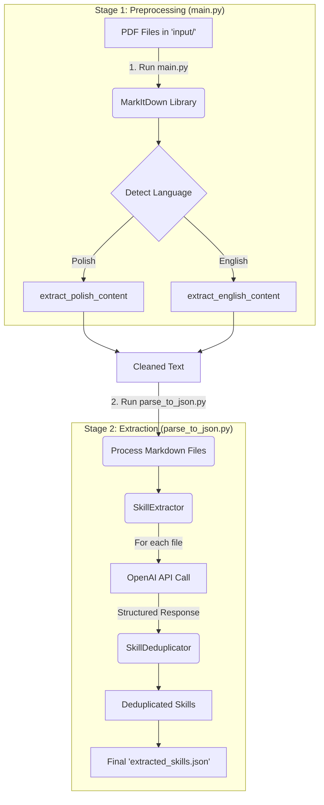
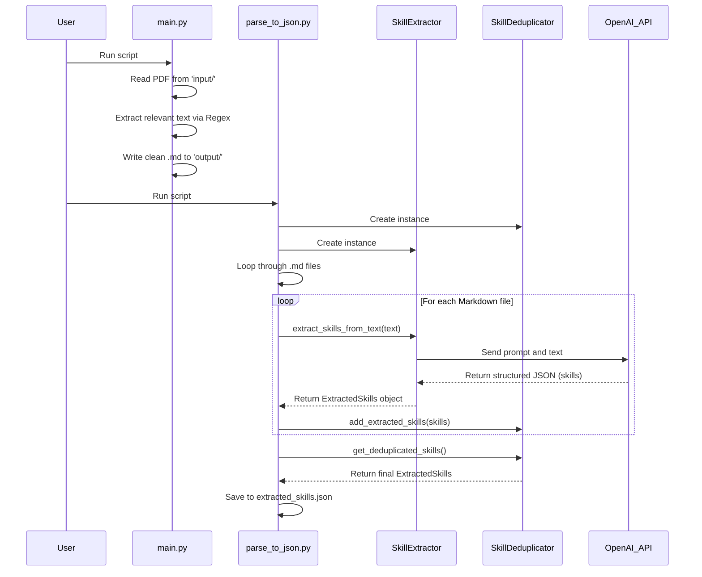

# Syllabus Skill Extractor

This project is designed to automatically extract technical and soft skills from university syllabus documents (in PDF format). It processes multiple files, uses an AI model to identify skills, and aggregates them into a single, deduplicated JSON file.

## Core Features

- **PDF Processing**: Ingests multiple PDF syllabus files.
- **Intelligent Preprocessing**: Uses regular expressions to isolate the most relevant sections ("learning outcomes") from the raw text, improving accuracy and reducing noise.
- **AI-Powered Extraction**: Leverages the OpenAI API (`gpt-4.1-nano`) with a specialized prompt to analyze text and extract skills in a structured format.
- **Structured Data Models**: Uses Pydantic to define a strict schema for skills, ensuring data consistency and reliability.
- **Skill Deduplication**: Intelligently combines skills from all documents into a single master list, removing duplicates.
- **Bilingual Support**: The preprocessing logic is designed to handle both Polish and English syllabuses.
- **JSON Output**: Generates a clean, machine-readable JSON file of all unique skills, ready for further analysis or integration.

## System Architecture and Flow

The project is architected as a two-stage pipeline:

1.  **Stage 1: Preprocessing**: Converts raw PDFs into clean, focused Markdown files.
2.  **Stage 2: Extraction & Aggregation**: Reads the Markdown files, extracts skills using AI, and saves the final, deduplicated data to JSON.

This separation of concerns makes the process modular, easier to debug, and more efficient.

### Process Flow Diagram

Here is a high-level diagram illustrating the entire data flow from PDF to JSON.



## How It Works: A Deeper Look

#### 1. Preprocessing (`main.py`)

The pipeline begins with `main.py`, which is responsible for cleaning the input data.

- **What it does**: It iterates through PDF files in the `input/` directory. For each PDF, it converts the content to raw text.
- **Why it's done this way**: Raw text from PDFs is often messy and contains a lot of irrelevant information (headers, footers, administrative details). Sending all of this to the AI would be inefficient and could lead to poor results. The script uses regular expressions (`extract_polish_content` and `extract_english_content`) to find and isolate the "learning outcomes" sections, which are the most information-rich for skill extraction. The cleaned, relevant text is saved as a Markdown file in the `output/` directory.

#### 2. Skill Extraction (`parse_to_json.py` and `extractor.py`)

This is the core of the project where the AI magic happens.

- **What it does**: The `process_markdown_files` function in `parse_to_json.py` reads each generated `.md` file. It then passes the text to the `SkillExtractor` class.
- `extractor.py` sends the text to the OpenAI API with a highly specific system prompt. This prompt instructs the AI to act as an expert and extract "Technologies" and "Soft Skills" (`UMIEJĘTNOŚCI MIĘKKIE`).
- **Why it's done this way**:
  - **Pydantic Models (`models.py`)**: The code defines the desired output structure using Pydantic models (`TechnologySkill`, `SoftSkill`). By passing `response_format=ExtractedSkills` to the OpenAI client, we force the AI to return a perfectly formatted JSON that matches our models. This avoids manual, error-prone parsing of the AI's response.
  - **Dedicated Extractor Class**: All the OpenAI logic is encapsulated in `SkillExtractor`. This makes the code clean and easy to maintain. If you wanted to switch to a different AI model, you would only need to change it in this one place.

#### 3. Aggregation & Deduplication (`parse_to_json.py`)

After extracting skills from all documents, they need to be combined into a single, clean list.

- **What it does**: As skills are extracted from each document, they are added to a `SkillDeduplicator` instance. This helper class maintains a dictionary of unique skills, using the lowercased skill name as the key. This ensures that "Python" and "python" are treated as the same skill and only added once.
- **Why it's done this way**: A dedicated class for deduplication keeps the main processing loop simple. It efficiently handles the logic of checking for duplicates before adding to the final list, resulting in a clean, aggregated dataset.

#### 4. Final Output (`parse_to_json.py`)

The final step is to save the results.

- **What it does**: The `save_to_json` function takes the final, deduplicated `ExtractedSkills` object, converts it to a dictionary, and writes it to `extracted_skills.json` with human-readable formatting (indentation).
- **Why it's done this way**: JSON is a universal format that is both human-readable and easily parsed by other applications, making it ideal for data storage and sharing.

### Component Interaction Diagram

This diagram shows how the different Python classes and modules interact with each other.



## How to Run the Project

1.  **Setup Environment**:

    - Install dependencies using uv: `uv sync`
    - Create a `.env` file in the root directory and add your OpenAI API key:
      ```
      OPENAI_API_KEY="your_api_key_here"
      ```

3.  **Run the Pipeline**:

    - **Step 1:** Run the preprocessing script to generate Markdown files.
      ```bash
      python main.py
      ```
    - **Step 2:** Run the extraction script to generate the final JSON.
      ```bash
      python parse_to_json.py
      ```

4.  **Check the Output**:
    - The final, aggregated list of skills will be available in `extracted_skills.json`.
